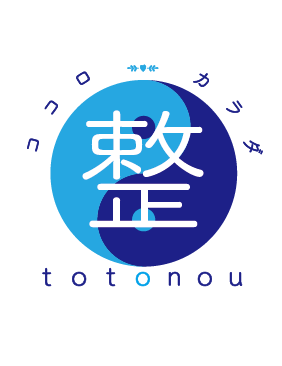

# CLAUDE.md

This file provides guidance to Claude Code (claude.ai/code) when working with code in this repository.

## プロジェクト概要

整体サロン「整 totonou」のホームページ。スタンドアロンHTML形式 — `index.html` 1ファイル（約980行）にHTML/CSS/JSがすべて収まっている。サーバー不要、ブラウザで直接開いて確認。

## 確認方法

`index.html` をブラウザで開く。編集後は **Cmd+Shift+R**（強制リロード）で画像キャッシュをクリア。

## Git コミット

```bash
git commit --no-gpg-sign -m "メッセージ"
```
`--no-gpg-sign` を必ず付けること（GPG署名エラー回避）。

## 画像ファイルのルール

- **base64埋め込み禁止** — 必ず外部ファイル参照（`index.html` と同じフォルダに置く）
- アイコンを画像ファイルに差し替える場合：

```html
<div class="ricon" style="border:none;width:78px;height:78px">
  
</div>
```
`border:none` 必須（画像自体の枠とCSSの枠が二重になるのを防ぐため）

## 画像ファイル一覧

| ファイル名 | 用途 |
|---|---|
| `logo-new.png` | ヘッダーロゴ・ヒーロー左下ロゴ（72px / 130px） |
| `logo.png` | フッターロゴ |
| `image-1779934233633.jpg` | スライドショー1枚目 |
| `image-1779934228345.jpg` | スライドショー2枚目 |
| `image-1779934231618.jpg` | スライドショー3枚目 |
| `image-1779934223142.jpg` | スライドショー4枚目 |
| `image-1779934235594.jpg` | スライドショー5枚目 |
| `concept.png` | CONCEPTセクション写真 |
| `about-1.jpg` | 当院ができること：カウンセリング（左上） |
| `about-2.jpg` | 当院ができること：体のおはなし（右上） |
| `about-3.jpg` / `about-3-new.jpg` | 当院ができること：セルフケア指導（左下） |
| `about-4.jpg` / `about-4-new.jpg` | 当院ができること：体質改善指導（右下） |
| `icons-about.png` | 当院ができることセクションのアイコン（骨・関節・筋肉・神経） |
| `icon-shoulder.png` | お悩みカード：肩こり・首こり |
| `icon-back.png` | お悩みカード：腰の張り・腰痛 |
| `icon-cold.png` | お悩みカード：冷え・むくみ |
| `icon-nerve.png` | お悩みカード：自律神経の乱れ |
| `icon-price.png` | お悩みカード：料金について |

## デザイントークン

```css
--teal: #48B4E0        /* メインカラー */
--teal-deep: #2E8FB8
--teal-soft: #E6F4FA
--beige: #EFEAD8
--warm: #FAF8F2        /* セクション背景 */
--ink: #2A2A2A         /* 本文テキスト */
--ink-soft: #5C5C5C
--line: #E5E5E0        /* 区切り線 */
```

フォント: `Noto Serif JP`（見出し）、`Noto Sans JP`（本文）、`Cormorant Garamond`（英字装飾）

## ページセクション構成

1. HEADER（固定） — logo-new.png、TEL: 070-9111-8430
2. HERO — 5枚スライドショー（5.5秒間隔自動切替）＋縦書きキャッチ
3. CONCEPT — concept.png + テキスト
4. ABOUT TILES — about-1〜4.jpg の4枚グリッド
5. CONCERN（お悩みカード）— icon-*.png の5枚カード
6. BEFORE & AFTER — ※写真未入稿（グラデーションダミー）
7. MENU & PRICE
8. VOICE（お客様の声）
9. THERAPIST — ※写真・氏名・経歴未入稿
10. INFO + SNS
11. ACCESS（Googleマップ未埋め込み）
12. CTA（予約バナー）
13. FOOTER

## ヘッダーブランドロゴ構成

```html
<a href="#" class="brand">
    <!-- 72px -->
  <div class="brand-text">
    <span class="ja">整体サロン</span>
    <div class="bottom-row">
      <span class="kanji">整</span>   <!-- 28px Noto Serif JP -->
      <span class="en">totonou</span> <!-- 22px Cormorant Garamond -->
    </div>
  </div>
</a>
```

## ヒーロー左下ブランド構成

```html
<div class="hero-brand">
  <div class="logo-circle">
      <!-- 130px -->
  </div>
  <div class="name">
    <span class="tag">整体サロン</span>  <!-- 18px、margin-bottom:-20px -->
    <div class="bottom-row">
      <span class="ja-name">整</span>       <!-- 78px Noto Serif JP -->
      <span class="en-name">totonou</span>  <!-- 34px Cormorant Garamond -->
    </div>
  </div>
</div>
```

## JS構成（index.html末尾 `<script>` タグ内）

- `header.scrolled` クラスのトグル（スクロール検知）
- ハンバーガーメニュー開閉
- スライドショー: `setInterval` 5500ms、`.slide.active` クラス切替
- スクロールフェードイン: `IntersectionObserver`、`.fade` → `.in` クラス付与

## 未完了の作業

| 項目 | 状態 |
|---|---|
| BEFORE & AFTER 写真 | ダミーグラデーション（写真未入稿） |
| 施術者 写真・氏名・経歴 | ダミーテキスト（要入力）、写真ファイル名は `therapist.jpg` 推奨 |
| 「症例をもっと見る」リンク | `href="#"` のまま |
| 「詳しいプロフィール」リンク | `href="#"` のまま |
| Googleマップ | `.access-map` に埋め込み未完了 |
| 営業時間・住所・料金 | ダミーデータの可能性あり（要確認） |
